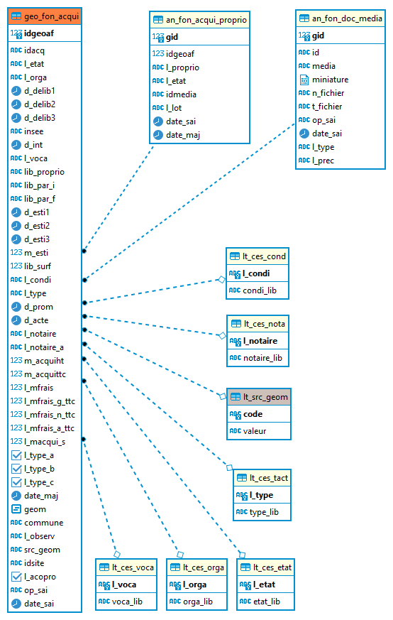

# Documentation d'administration de la base de données "Foncier" en partie urbanisée avec la thématique "Aménagement" et "Activité Economique" #

## Principes
  * **généralité** :

En 2015, lors de la mise en oeuvre de l'IDG locale GeoCompiegnois, une réflexion globale sur la base de données et les données métiers se sont engagées au sein du pôle aménagement, urbanisme et grand projet. Il s'est avéré dans  ce diagnostic que les données utilisées dans ce pôle et le service développement économique avaient des ramifications communes. En effet l'Agglomération de la Région de Compiègne maîtrise le foncier dans ces zones d'aménagements, les viabilise afin de procéder à la commercialisation de lots à vocation multiple (économique, habitat, équipement, ...). De la procédure d'aménagement en passant par l'acquisition puis la cession des terrains, cette chaîne de "production" nous a incité à développer le concept d'urbanisation des données sur cette thématique. Autour de ce concept gravite des données purement métiers (suivi de l'activité économique des entreprises, suivi de l'offre des locaux commerciaux ou des commerces de centre-ville, ...) qui ont été rattachées à cette base de données urbanisées. 

Le contexte d'urbanisation répond à cette double particularité :
   - les données sont partagées pour répondre aux besoins de gestions et d'analyses dont la particularité est de toujours intégrer les
problématiques de plusieurs métiers,
   - un même objet géographique "virtuel", la plupart du temps, participe à plusieurs métiers.

De ce fait un objet géographique est partagé par plusieurs services et les attributs métiers propres à chacun sont gérés dans une classe indépendante. Des vues métiers sont ainsi réalisées reprenant la géométrie de l'objet partagé. Cette organisation permet de modifier un seul objet pour tout le monde et évite ainsi les doublons d'informations.

En 2022, un nouveau cadre de mutualisation a réorienté les choix initiaux en terme d'urbanisation. Certaines données resteront dans le domaine de l'urbanisation et le partage entre services. Mais des choix fonctionnels impactants certaines informations ont remis en cause ce mode de gestion pour certaines d'entre elles (les sites et les procédures d'aménagements). Cette documentation présente uniquement les données relevant d'une gestion indépendante. Les autres informations évoquées précédemment sont consultables dans la documentation du répertoire `acti_eco`.

 
## Modèle relationel simplifié

## Dépendances

Seule la liste de valeur `lt_src_geom` est issu d'un autre schéma `r_objet`.

## Classes d'objets du foncier

L'ensemble des classes d'objets de gestion sont stockés dans le schéma `m_foncier`.

### Classes d'objets avec une primitive graphique :
  
`[m_foncier].[geo_fon_acqui]` : table géographique contenant les acquisitions foncières
   
|Nom attribut | Définition | Type | Valeurs par défaut |
|:---|:---|:---|:---|
|idgeoaf|Identifiant unique de l'objet|integer|nextval('m_foncier.ces_seq'::regclass)|
|idacq|Identifiant du dossier (issu de DynMap)|character varying(10)| |
|l_etat|Code de l'état de l'acquisition du foncier|character varying(2)| |
|l_orga|Code de l'organisme acquéreur|character varying(2)| |
|d_delib1|Date de la délibération (1)|timestamp without time zone| |
|d_delib2|Date de la délibération (2)|timestamp without time zone| |
|d_delib3|Date de la délibération (3)|timestamp without time zone| |
|insee|Code Insee de la commune|character varying(20)| |
|d_int|Date d'ouverture du dossier|timestamp without time zone| |
|l_voca|Code de la vocation de l'acquisition|character varying(2)| |
|lib_proprio|Libellé du propriétaire initial|character varying(100)| |
|lib_par_i|Identifiant des parcelles initiales|character varying(254)| |
|lib_par_f|Identifiant des parcelles finales|character varying(50)| |
|d_esti1|Date d'estimation(1)|timestamp without time zone| |
|d_esti2|Date d'estimation(2)|timestamp without time zone| |
|d_esti3|Date d'estimation(3)|timestamp without time zone| |
|m_esti|Montant de l'estimation en € HT|double precision| |
|lib_surf|Surface cadastrée en m²|integer| |
|l_condi|Code de la condition de cession|character varying(2)| |
|l_type|Code du type d'acte|character varying(2)| |
|d_prom|Date de la promesse de vente|timestamp without time zone| |
|d_acte|Date de l'acte de vente|timestamp without time zone| |
|l_notaire|Code du Nom du notaire|character varying(2)| |
|l_notaire_a|Autre(s) notaire(s)|character varying(50)| |
|m_acquiht|Montant de l'acquisition en € HT|double precision| |
|m_acquittc|Montant de l'acquisition en € TTC|double precision| |
|l_mfrais|Montant des frais global|double precision| |
|l_mfrais_g_ttc|Montant des frais de géomètre TTC|double precision| |
|l_mfrais_n_ttc|Montant des frais de notaire TTC|double precision| |
|l_mfrais_a_ttc|Montant des frais autres (agences, divers, ...) TTC|double precision| |
|l_macqui_s|Montant de l'acquisition en € HT par m²|double precision| |
|l_type_a|Type de montant : terrain|boolean| |
|l_type_b|Type de montant : bâti|boolean| |
|l_type_c|Type de montant : surface de plancher|boolean| |
|date_maj|Date de mise à jour des données|timestamp without time zone| |
|l_observ|Observations diverses|character varying(255)| |
|idsite|Identifiant unique du site|character varying(10)| |
|l_acopro|Attribut permettant de distinguer si l'acquisition concerne 1 propriété unique ou une copropriété avec n procédures d'acquisition (1 par propriétaire). Dans ce dernier cas, la table an_fon_acqui_proprio peut-être alimenté par le nombre de propriétaire en question|boolean|false|
|op_sai|Opérateur de saisie|character varying(80)| |
|date_sai|Date de saisie|timestamp without time zone| |

Particularité(s) à noter :
* Une clé primaire existe sur le champ `idgeoaf` l'attribution automatique de la référence unique s'effectue via une séquence. 
* Une clé étrangère existe sur la table de valeur `l_condi` (lien vers la liste de valeurs de l'état du site `lt_ces_cond`)
* Une clé étrangère existe sur la table de valeur `l_notaire` (lien vers la liste de valeurs de la destination du site `lt_ces_nota`)
* Une clé étrangère existe sur la table de valeur `src_geom` (lien vers la liste de valeurs de la typologie du site `lt_src_geom`)
* Une clé étrangère existe sur la table de valeur `l_type` (lien vers la liste de valeurs du type de site `lt_ces_tact`)
* Une clé étrangère existe sur la table de valeur `l_etat` (lien vers la liste de valeurs de la vocation du site `lt_ces_etat`)
* Une clé étrangère existe sur la table de valeur `l_orga` (lien vers la liste de valeurs des référentiels de saisie `lt_ces_orga`)
* Une clé étrangère existe sur la table de valeur `l_voca` (lien vers la liste de valeurs des référentiels de saisie `lt_ces_voca`)

* 4 triggers :
  * `t_t0_secu_geom_epci` : trigger permettant de contrôle la saisie entre EPCI
  * `t_t2_insee` : trigger permettant d'intégrer le code insee et le nom de la commune
  * `t_t3_insert_date_sai` : trigger permettant d'intégrer la date de saisie
  * `t_t4_insert_date_maj` : trigger permettant d'intégrer la date de mise à jour

### Classes d'objets attributaire :

`[m_foncier].[an_fon_acqui_proprio]` : table géographique contenant les caractéristiques des acquisitions lors d'une acquisition foncière en copropriété. Cette table est liée à la table `geo_fon_acqui` 
   
|Nom attribut | Définition | Type | Valeurs par défaut |
|:---|:---|:---|:---|
|gid|Identifiant unique (clé interne)|integer|nextval('m_foncier.an_fon_acqui_proprio_gid_seq'::regclass)|
|idgeoaf|Identifiant de l'acquisition foncière|integer| |
|l_proprio|Libellé du propriétaire|character varying(254)| |
|l_etat|Etat du dossier (liste de valeur état du dossier des acquisitions)|character varying(2)|0|
|l_lot|Numéro du lot de copropriétés concernés|character varying(20)| |
|date_sai|Date de saisie de la donnée dans la base|timestamp without time zone| |
|date_maj|Date de mise à jour de la donnée dans la base|timestamp without time zone| |

Particularité(s) à noter :
* Une clé primaire existe sur le champ `gid` l'attribution automatique de la référence unique s'effectue via une séquence. 

* 2 triggers :
  * `t_t1_m_acqui_proprio_idmedia` : trigger permettant de contrôle la saisie entre EPCI
  * `t_t2_insert_date_maj` : trigger permettant de générer une clé partoculière `idmedia` composée du n° d'acquisition et du gid

`[m_foncier].[an_fon_doc_media]` : table alphanumérique des médias joints aux acquisitions

Cette table est détaillée dans le répertoire `acti_eco` car partagée avec les cessions foncières.

#### Liste de valeurs

Ces listes sont partagées avec les objets urbanisés de l'activité économique dans lesquels se trouvent les données de cessions foncières.

### classes d'objets applicatives métiers :

  * `xapps_geo_v_ces_acqu_n` : Vue applicative affichant les cessions et les acquisitions de l'ARC et de la ville de Compiègne (par rapport à la date de l'acte notarié) entre maintenant et le 1er janvier du millésime du dernier cadastre en base
  * `xapps_geo_v_ces_acqu_n1` :  Vue applicative affichant les cessions et les acquisitions de l'ARC et de la ville de Compiègne entre maintenant et la date l'acte notarié qui doit être inférieur à 2 ans (n+n-1)

### classes d'objets applicatives grands publics sont classés dans le schéma x_apps_public :

Sans objet

### classes d'objets opendata sont classés dans le schéma x_opendata :

Sans objet

## Projet QGIS pour la gestion

 * `ECO_AMT_FON_3.4.qgs` : projet QGIS en cours de refonte pour la gestion des lots, acquisitions, sites, ...

## Traitement automatisé mis en place (Workflow de l'ETL FME)

Sans objet

## Export Open Data

Sans objet

---
